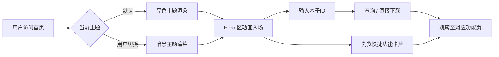

## 1. 产品概述

JM Downloader Web 是一款基于 Flask + htmx 的禁漫天堂（JMComic）下载管理器 Web 前端。本次重构聚焦于**首页（Index Page）**的视觉升级，打造媲美大厂游戏官网（原神、明日方舟、碧蓝航线）质感的主视觉页面，同时保留原有功能逻辑不变。

- **核心目标**：将现有 Bootstrap 暗色风格首页升级为具有二次元/游戏官网美学的高品质前端界面
- **目标用户**：使用 JM Downloader 进行漫画下载管理的二次元爱好者

## 2. 核心功能

### 2.1 功能模块

| 模块 | 描述 |
|------|------|
| **双主题切换系统** | 亮色模式（白+激情红 #FF2A55）与暗黑模式（极客黑 #121212+赛博橙 #FF6B00），通过 CSS 变量实现全站平滑过渡 |
| **KV 主视觉区 (Hero Section)** | 游戏官网风格 Hero 区：艺术字标题、二次元看板娘插画区、仪式感输入框与 CTA 按钮 |
| **动态效果系统** | 页面加载层次感淡入上滑、悬停缩放/光晕/色彩渐变、克制丝滑的微动效 |
| **快捷功能卡片区** | 毛玻璃效果卡片展示搜索浏览、下载管理、文件浏览、收藏夹四大入口 |

### 2.2 页面详情

| 页面名称 | 模块名称 | 功能描述 |
|-----------|----------|----------|
| 首页 | 主题切换按钮 | 顶部导航栏右侧优雅的月亮/太阳图标切换按钮，点击平滑过渡主题色 |
| 首页 | KV 主视觉区 | 左侧大标题（艺术字体 + text-shadow/渐变）+ 右侧看板娘插画 + 中央输入框 + 核心下载按钮（带脉冲微动效） |
| 首页 | 快捷功能卡片 | 四张毛玻璃效果（backdrop-filter: blur）的功能入口卡片，悬停时有 scale + glow 效果 |
| 首页 | 快速下载面板 | 保留原有的 Alpine.js 驱动的快速下载功能，UI 风格与新设计统一 |

## 3. 核心流程

## 4. 用户界面设计

### 4.1 设计风格

**整体调性**：二次元游戏官网美学 — 热血、精致、仪式感强

| 设计维度 | 亮色模式 (Mode A - 默认) | 暗黑模式 (Mode B) |
|---------|------------------------|-------------------|
| **主背景色** | `#FFFFFF` 纯白 | `#121212` 极客黑 |
| **副色调/点缀** | `#FF2A55` 热血激情红 | `#FF6B00` 赛博活力橙 |
| **文字主色** | `#1A1A2E` 深墨色 | `#F0F0F0` 浅灰白 |
| **文字次色** | `#6B7280` 中性灰 | `#9CA3AF` 暗灰 |
| **卡片背景** | `rgba(255,255,255,0.72)` 毛玻璃白 | `rgba(30,30,40,0.65)` 毛玻璃深 |
| **边框色** | `rgba(0,0,0,0.08)` | `rgba(255,255,255,0.08)` |
| **渐变背景** | 白 → 极浅粉渐变 | 深黑 → 深紫黑渐变 |

- **按钮样式**：圆角胶囊形（border-radius: 9999px），主操作按钮带渐变色背景 + 内阴影立体感
- **字体方案**：
  - 标题字体：`Noto Serif SC`（思源宋体）用于艺术字标题，配合 CSS `background-clip: text` 渐变效果
  - 正文字体：`Noto Sans SC`（思源黑体）作为 UI 字体
  - 英文装饰：`Orbitron`（科技感）或 `Righteous`（圆润艺术感）
- **布局风格**：Flexbox 居中布局 + CSS Grid 卡片区，大留白设计
- **图标风格**：保留 Bootstrap Icons，增强色彩表现力

### 4.2 页面设计概览

| 区域 | UI 元素 | 动效描述 |
|------|---------|----------|
| **顶部导航栏** | Logo + 导航链接 + 主题切换按钮 | 固定定位，毛玻璃背景，主题色跟随切换 |
| **KV Hero 区** | 左侧：超大艺术字标题 + 副标题；中央：输入框 + CTA 按钮；右侧：看板娘插画 | 加载时 staggered fade-in + slide-up（标题→副标题→输入框→按钮→插画依次入场），间隔 150ms |
| **快捷功能区** | 4 张等宽功能卡片（搜索/下载/文件/收藏） | 每张卡片 backdrop-filter: blur(16px)，hover 时 translateY(-8px) + box-shadow glow + border-color 点缀色高亮 |
| **快速下载面板** | 输入框 + 查询按钮 + 结果展示 | 与 Hero 区统一视觉语言，Alpine.js 交互保持不变 |

### 4.3 响应式策略

- **桌面优先（Desktop-first）**：以 1440px 为基准设计宽度
- **平板适配（≤1024px）**：Hero 区改为上下堆叠，插画缩小为背景装饰
- **移动端适配（≤768px）**：卡片变为 2x2 网格，字号缩放，导航栏折叠
- **触控优化**：按钮最小点击区域 44x44px

### 4.4 动效规范

| 动效类型 | 触发方式 | 参数规范 |
|---------|---------|----------|
| **Fade-in + Slide-up** | 页面加载 | opacity: 0→1, translateY(30px)→0, duration: 0.8s, easing: cubic-bezier(0.16, 1, 0.3, 1) |
| **Hover Scale + Glow** | 鼠标悬停卡片/按钮 | scale: 1→1.03, box-shadow 扩散, duration: 0.35s, easing: ease-out |
| **主题切换过渡** | 点击切换按钮 | 全站 CSS 变量 transition: background-color 0.5s, color 0.5s, box-shadow 0.5s |
| **CTA 按钮脉冲** | 持续运行 | box-shadow pulse 动画 2s infinite, subtle glow breathing |
| **Staggered 入场** | 页面加载 | 各元素 animation-delay: 0ms / 150ms / 300ms / 450ms / 600ms |
