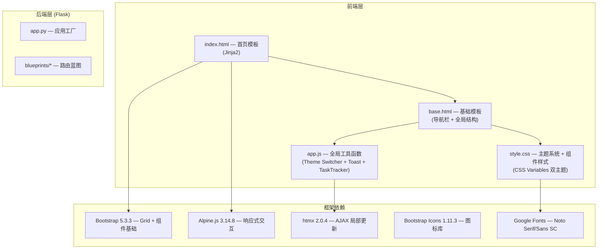

## 1. 架构设计



## 2. 技术选型

| 技术栈 | 版本 | 用途说明 |
|--------|------|----------|
| **Flask** | 已有 | 后端框架，模板渲染引擎 Jinja2 |
| **Bootstrap 5.3.3** | 已有 | 基础网格系统和组件骨架（保留但不重度依赖其视觉样式） |
| **Alpine.js 3.14.8** | 已有 | 首页快速下载交互逻辑驱动 |
| **htmx 2.0.4** | 已有 | 局部页面更新 |
| **Bootstrap Icons 1.11.3** | 已有 | 图标 |
| **Google Fonts** | 新增 | Noto Serif SC（标题）、Noto Sans SC（正文） |
| **纯 CSS** | 新增 | 双主题变量系统、动效、毛玻璃、Hero 布局 |

> **关键决策**：不引入新的前端框架（React/Vue），在现有技术栈基础上通过 **CSS 变量主题系统 + 精致 CSS 动画** 实现大厂级视觉效果。这确保了与现有 Flask/Jinja2/htmx/Alpine.js 架构完全兼容。

## 3. 文件修改清单

| 文件路径 | 修改类型 | 修改内容 |
|---------|---------|---------|
| `jm_web/templates/base.html` | **修改** | 更新 `<head>` 引入 Google Fonts；更新 `<body>` 类和导航栏样式；添加主题切换按钮到导航栏 |
| `jm_web/templates/index.html` | **重写** | 全新 Hero Section + 快捷卡片区 + 保留 Alpine.js 快速下载逻辑 |
| `static/css/style.css` | **重写** | 完整的双主题 CSS 变量系统 + Hero 样式 + 动画 keyframes + 毛玻璃卡片 + 响应式 |
| `static/js/app.js` | **修改** | 新增 ThemeSwitcher 模块（localStorage 持久化 + CSS 变量切换） |

## 4. CSS 变量体系设计

```css
/* === 亮色主题 (默认) === */
[data-theme="light"] {
    --bg-primary: #FFFFFF;
    --bg-secondary: #FAFAFA;
    --bg-hero-from: #FFFFFF;
    --bg-hero-to: #FFF0F3;
    --bg-glass: rgba(255, 255, 255, 0.72);
    --bg-glass-hover: rgba(255, 255, 255, 0.88);
    --text-primary: #1A1A2E;
    --text-secondary: #6B7280;
    --text-muted: #9CA3AF;
    --accent: #FF2A55;
    --accent-light: #FF4D6D;
    --accent-glow: rgba(255, 42, 85, 0.25);
    --accent-gradient: linear-gradient(135deg, #FF2A55, #FF6B6B);
    --border-color: rgba(0, 0, 0, 0.08);
    --border-glass: rgba(0, 0, 0, 0.06);
    --shadow-sm: 0 2px 8px rgba(0, 0, 0, 0.04);
    --shadow-md: 0 8px 30px rgba(0, 0, 0, 0.08);
    --shadow-glow: 0 0 30px rgba(255, 42, 85, 0.15);
    --nav-bg: rgba(255, 255, 255, 0.75);
    --input-bg: #F9FAFB;
    --input-border: #E5E7EB;
    --card-icon-bg: rgba(255, 42, 85, 0.06);
}

/* === 暗黑主题 === */
[data-theme="dark"] {
    --bg-primary: #121212;
    --bg-secondary: #1A1A1E;
    --bg-hero-from: #121212;
    --bg-hero-to: #1A0A1E;
    --bg-glass: rgba(30, 30, 40, 0.65);
    --bg-glass-hover: rgba(40, 40, 55, 0.75);
    --text-primary: #F0F0F0;
    --text-secondary: #9CA3AF;
    --text-muted: #6B7280;
    --accent: #FF6B00;
    --accent-light: #FF8C33;
    --accent-glow: rgba(255, 107, 0, 0.25);
    --accent-gradient: linear-gradient(135deg, #FF6B00, #FF9500);
    --border-color: rgba(255, 255, 255, 0.08);
    --border-glass: rgba(255, 255, 255, 0.06);
    --shadow-sm: 0 2px 8px rgba(0, 0, 0, 0.2);
    --shadow-md: 0 8px 30px rgba(0, 0, 0, 0.3);
    --shadow-glow: 0 0 30px rgba(255, 107, 0, 0.15);
    --nav-bg: rgba(18, 18, 18, 0.8);
    --input-bg: #1E1E24;
    --input-border: #333340;
    --card-icon-bg: rgba(255, 107, 0, 0.08);
}
```

## 5. 动画 Keyframes 规划

```css
/* 入场动画 */
@keyframes fadeSlideUp {
    from { opacity: 0; transform: translateY(36px); }
    to   { opacity: 1; transform: translateY(0); }
}

/* CTA 按钮脉冲光晕 */
@keyframes ctaPulse {
    0%, 100% { box-shadow: 0 0 0 0 var(--accent-glow); }
    50%      { box-shadow: 0 0 24px 8px var(--accent-glow); }
}

/* 背景微粒漂浮 */
@keyframes float {
    0%, 100% { transform: translateY(0) rotate(0deg); }
    50%      { transform: translateY(-20px) rotate(3deg); }
}
```

## 6. 主题切换 JS 逻辑

```javascript
// ThemeSwitcher — 基于 localStorage 的主题持久化
// 1. 页面加载时读取 localStorage['theme']，默认 'light'
// 2. 设置 document.documentElement.setAttribute('data-theme', value)
// 3. 切换按钮点击时 toggle light/dark，同步更新 icon（太阳↔月亮）
// 4. 全站 transition 通过 CSS 变量的 transition 属性自动生效
```
